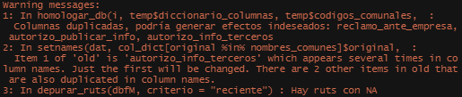

# Homologación {#capitulo-homologacion}

```{r, echo=FALSE, message=FALSE, warning=FALSE}
library(readxl)
library(data.table)
library(kableExtra)
columnas <- data.table(read_excel("../../../DATA/homologacion_columnas.xlsx"))
motivos_legales <- data.table(read_excel("../../../DATA/arbol_de_mercado.xlsx", "ACTUAL"))
```

El proceso de homologación se subdivide en varias etapas, que serán las secciones que componen este apartado. Para llegar a este proceso, se realizó un exhaustivo trabajo previo, que no es posible de automatizar para disponibilizarlo, pero que en base a dicho proceso, se puede ejecutar un proceso semi-automático que permita a los usuarios ir agregando nueva información de manera más rápido, eficiente y confiable.

Se generó un proceso lo más flexible posible, que permite agregar nuevos motivos legales y nuevas variables de trabajo que estén en la base de datos, por medio de archivos Excel (para facilitar su manipulación por parte del usuario final). Conforme la base de datos va creciendo en tamaño, algunas de estas características podrían no funcionar adecuadamente, por lo cual es crucial entender bien este proceso y vigilar su correcto funcionamiento, a través de las herramientas aquí proporcionadas y por los mismos avisos que entrega el código conforme se va ejecutando.


## Variables de interés {#variables-interes}

El primer paso, y el más importante, es definir qué variables se utilizarán (cada variable hace referencia a una columna de la base de datos).

Los nombres de columnas fueron previamente ordenados, clasificados y estandarizados en un trabajo conjunto con SERNAC. En un principio, unificando todas las bases de datos desde el 2010, se contaba con `r nrow(columnas)` columnas diferentes.

Determinar cuál de dichas variables podrían ser valiosas para el objetivo de detectar situaciones de reclamos atípicas, implicó un largo tiempo de compenetración y comprensión con la base de datos, que fue posible gracias al trabajo conjunto con el equipo de SERNAC.

Este trabajo fue condensando en el archivo [`homologacion_columnas`](wwww.tecpar.cl/SERNAC/homologacion_columnas.xlsx), el cual es un documento en formato Excel que contiene el nombre de una columna, su equivalencia estandarizada y si será o no utilizada en el sistema de alerta.


### Marcar una columna como variable a utilizar

En la tabla \@ref(tab:bd-columnas-homologacion) se puede ver un extracto del archivo [`homologacion_columnas`](wwww.tecpar.cl/SERNAC/homologacion_columnas.xlsx), para aquellas variables que serán utilizadas por el sistema de alertas. Las tres columnas de interés son `original`, `nuevo` y `Uso`, que marcan el nombre original con que venía en la base de datos, su nombre equivalente homologado y si la columna será o no utilizada como variable de interés, respectivamente. Para el caso de la columna `Uso`, se marcan con un $1$ aquellas columnas que serán utilizadas (y con $0$ las que no).

```{r, echo=FALSE, results='asis'}
knitr::kable(head(columnas[Uso==1, c("original", "nuevo", "Uso")], 10), booktabs=TRUE, label="bd-columnas-homologacion",
             caption="Ejemplo de columnas/variables y su nombre homologado, que serán utilizadas para el sistema de alertas.")
```

Una nueva tabla es retornada con los nombres de las columnas modificadas de acuerdo al archivo `homologacion_columnas`.

### Agregar una columna como variable a utilizar

Basta con añadir una fila extra al archivo, indicando el nombre original, su nuevo nombre (puede ser el mismo) y el valor $1$ en al columna, bajo las columnas `original`, `nuevo` y `Uso` respectivamente. Otra información anexa de interés (como por qué se agrega, cuándo, etc) puede ser añadida en otras columnas sin problema, puesto que serán ignoradas al momento de hacer la conversión.


### Resumen de variables {#seccion-resumen-variables}

Las variables que se consideraron son las siguientes (como se mencionó previamente, se pueden agregar o quitar):

1. `caso_cierre_fecha`: fecha cuando se cerró el reclamo. Corresponde a los nombres originales de `caso_fecha_cierre` y `fecha_resultado`.
1. `caso_creacion_fecha`: fecha cuando se creó el reclamo. Corresponde al nombre original de `caso_fecha_creacion`. 
1. `caso_numero`: número del caso, equivalente a un identificador único. Corresponde a los nombres originales de `caso_numero` y `numero_caso`.
1. `categoria_motivo_legal`: inicialmente contenía 371 motivos únicos originales, que fueron reducidos a 83, después de aplicar la conversión utilizando el árbol de motivos legales (sección \@ref(seccion-motivos-legales)). Esta es una subcategoría de `motivo_legal_descripcion`. Corresponde a las nombres originales de `cat_motiv_legal`, `categoria_mercado_prov`, `categoria_mercado_sucursal`, `categoria_ml` y `categoria_motivo_legal`.
1. `cierre_corto`: resume el tipo de cierre que se le dio al caso (el proveedor acoge, no acoge, no responde, entre otros). Corresponde al nombre original de `cierre_corto`.
1. `consumidor_comuna`: nombre de la comuna de la persona que realiza el reclamo. En la sección \@ref(seccion-codigos-comunales)) se especifican mayores detalles respecto a su tratamiento, pero esta columna pasa a llamarse `cut_comuna`. Corresponde a los nombres originales de `comuna_consumidor` y `cons_comuna`. Actualmente no está en uso, pero se conserva por futuras necesidades.
1. `consumidor_genero`: indica el género del reclamante (masculino, femenino o prefiero no decirlo). Corresponde a los nombres originales de `cons_genero` y `genero_consumidor`.
1. `consumidor_id`: número único que identifica al consumidor. Corresponde a los nombres originales de `cons_id` y `id_consumidor`. Actualmente no está en uso, por carecer de información útil, pero se conserva por futuras necesidades.
1. `estado_caso_nombre`: indica si el caso está ingresado, en proceso o cerrado. Corresponde a los nombres originales de `estado_caso` y `estado_caso_nombre`.
1. `mercado_tipo_producto_nombre`: actualmente cuenta con 180 categorías de productos y depende de. Corresponde a los nombres originales de `mercado_tipo_producto_nombre` y `tipo_prod`.
1. `motivo_legal_descripcion`: inicialmente contenía 48 motivos únicos, reorganizados en 17, después de aplicar la conversión utilizando el árbol de motivos legales. Describe el motivo legal principal del reclamo. Corresponde a los nombres originales de `motivo_legal` y `motivo_legal_descripcion`.
1. `proveedor_mercado_categoria_nombre`: actualmente tiene 30 categorías de industrias (bancos, tarjetas multitiendas, clínicas, etc). Corresponde a los nombres originales de `mercado_categoria_nombre`, `nombre_categoria_mercado` y `prov_mercado_categoria_nombre`.
1. `proveedor_mercado_nombre`: representa el mercado al cual pertenece el reclamo. Actualmente sólo se utiliza el mercado financiero, salud, seguros y previsión. Corresponde a los nombres originales de `mercado_nombre`, `mercado_prov`, `nombre_mercado` y `prov_mercado_nombre`.
1. `proveedor_nombre_fantasia`: nombre de fantasía o razón social del proveedor (ver \@ref(seccion-homologacion-interna) para más detalles sobre la homologación de esta variable). Corresponde a los nombres originales de `nombre_fantasia_proveedor` y `proveedor_nombre_fantasia`.
1. `proveedor_rut`: número entero, que representa el RUT (sin digito verificador) del proveedor. Corresponde a los nombres originales de `proveedor_rut` y `rut_proveedor`.
1. `reclamo_descripcion`: transcripción del reclamo presentado. Corresponde a los nombres originales de `descripcion_inconformidad` y `reclamo_descripcion`.

Estos nombres estandarizados se definieron en base a un criterio de pertenencia, es decir, las columnas que hacen referencias al consumidor, parten con el nombre de consumidor; lo mismo con el proveedor, el caso, etc. Con esto se busca facilitar la búsqueda de variables de interés y facilitar su agrupamiento.

Los formatos para las variables de fechas son `YYYY-mm-dd %H:%M:%S` o `YYYY-mm-dd %H:%M`. `YYYY` corresponde al año completo (ej: 1998), `mm` al mes en formato númerico (01 a 12), 'dd' al día del mes (01 a 31), `%H` a la hora (00 a 23), `%M` a los minutos (00 a 59) y `%S` a los segundos (00 a 59). Mayor información sobre los formatos de fechas pueden ser encontrados en <https://stat.ethz.ch/R-manual/R-devel/library/base/html/strptime.html>.

## Homologación en base a variables externas {#homologacion-variables-externas}

Una primera fase está definida por la homologación que se realiza en base a fuentes de información externas a la base de datos de reclamos de SERNAC. Algunas de ellas guardan relación directa, pero otras corresponden a información proveniente de otros organismos del Estado (como el Servicio de Impuestos Internos y el Ministerio de Energía).


### Motivos legales {#seccion-motivos-legales}

Uno de los principales problemas iniciales, fue la gran diversidad existente de motivos legales, y sus subcategorías (`motivo_legal_descripcion` y `categoria_motivo_legal`). Gracias al trabajo conjunto con SERNAC, se construyó un diccionario (árbol) de equivalencias, entre los motivos legales originales y una nueva nomenclatura que permitiera condensarlos de manera apropiada, según el juicio experto del área encargada.

Una muestra de dicho árbol se puede apreciar en la tabla \@ref(tab:bd-columnas-motivos-legales), el cual está contenido en el archivo Excel [`arbol_de_mercado`](wwww.tecpar.cl/SERNAC/arbol_de_mercado.xlsx). Para agregar nuevos motivos legales, basta con agregar nuevas filas a dicho archivo y asegurarse de usarlo al momento de llamar a las funciones de homologación. Esta etapa, no agrega nuevas columnas y modifica las ya existentes.

```{r, echo=FALSE, results='asis'}
set.seed(4849)
mtable <- knitr::kable(motivos_legales[sample(1:nrow(motivos_legales), 4), 
                             c("proveedor_mercado_nombre", "motivo_legal_descripcion", "categoria_motivo_legal", "PROPUESTA DE FUSION MOTIVO LEGAL", "PROPUESTA DE FUSION CATEGORIA LEGAL")], 
             booktabs=TRUE, 
             col.names=c("MERCADO", "MOTIVO LEGAL", "CATEGORIA LEGAL", "PROPUESTA DE FUSION MOTIVO LEGAL", "PROPUESTA DE FUSION CATEGORIA LEGAL"),
             label="bd-columnas-motivos-legales",
             caption="Ejemplo de motivos legales y sus respectivas homologaciones.")
kable_styling(mtable, latex_options = c("striped", "scale_down"), bootstrap_options=c("condensed", "responsive"), font_size = 10)
```

Motivos legales que no estén en este árbol, son añadidos al archivo `arbol_mercado_a_corregir.csv` que se genera en el directorio desde donde se está ejecutando el programa. Este archivo puede ser explorado y revisado desde Excel, para luego hacer las modificaciones pertinentes al `arbol_de_mercado` y correr el proceso nuevamente.


### Códigos comunales {#seccion-codigos-comunales}

Debido a que las comunas fueron añadadias a la base de datos utilizando el nombre de la misma, se detectaron varios inconsistencias sobre ellas. Es recomendable utilizar una codificación estándar, menos propensa a errores, como el [código único territorial](http://www.sinim.gov.cl/archivos/centro_descargas/modificacion_instructivo_pres_codigos.pdf). La versión en formato Excel descargable del archivo, se obtiene desde <http://datos.energiaabierta.cl/rest/datastreams/250790/data.xls?applyFormat=1>, que es la que se ha estado ocupando hasta ahora, bajo el nombre de `codigos_comunales.xlsx`. Si nuevas comunas o regiones son incorporadas/modificadas, modificar el archivo, manteniendo el formato (nombre de las columnas y tipo de datos).

Algunas comunas como *CON CON* y *SAN VICENTE DE TAGUA TAGUA*, oficialmente son reportadas como *Concón* y *San Vicente*, por lo que primero se debe lidear con este tipo de incosistencias para lograr obtener el código territorial correcto.

1. Se transforman todos los nombres a minúsculas.
1. Se reemplazan caracteres latinos por su equivalente (tildes por la vocal sin tilde, ñ por n).
1. Se comparan los nombres de ambas tablas, y a los que coinciden se les asigna el código territorial comunal.
1. Aquellos que no coinciden, se revisan de manera manual y se arma un diccionario de equivalencias (actualmente tiene 14, entre ellas las dos comunas utilizadas de ejemplo), y luego se les asigna el código territorial comunal.
1. Del código territorial comunal, se extrae el código de la provincia y de la región.

Los nuevos valores son almacenados en las columnas: `cut_comuna`, `cut_provincia`, `cut_region`. Las columas originales son descartadas.


### Datos del SII {#homologacion-datos-sii}

Originalmente se incorporó esta información pensando en el modelo de riesgo y se conserva por si se desea realizar algún tipo de análisis tomando en cuenta el tamaño de la empresa. Los datos deben ser previamente descargados en formato csv desde <http://www.sii.cl/sobre_el_sii/nominapersonasjuridicas.html>. Hasta ahora se han usado datos desde <http://www.sii.cl/sobre_el_sii/nomina_empresas_pjuridicas_at2018.xlsx> y <http://www.sii.cl/estadisticas/nominas/empresas_perjurihistorico.zip>. 

Por cada RUT en la base de datos del SII, se elige la información más actual (debido a que una misma empresa puede figurar en años/periodos diferentes). Luego se unen ambas bases de datos a través del RUT del proveedor, sin dígito verificador y a la base de datos princiapl se le agrega la columna `tramo_ventas`, que abarca un total de 13 niveles (ver tabla \@ref(tab:tramos-sii)). Más información sobre esta variable puede ser encontrada en el sitio del [SII](http://www.sii.cl/estadisticas/empresas_tamano_ventas.htm). 

```{r, echo=FALSE, results='asis'}
mtable <- knitr::kable(SII_sizes[-14, c(1, 3:4)], booktabs=TRUE, label="tramos-sii", 
                       caption="Tamaños de empresas por tramo de ventas.",
                       col.names=c("Código", "Tramo de ventas", "Rango de ventas"))
kable_styling(mtable, latex_options = c("striped", "scale_down"), bootstrap_options=c("condensed", "responsive"))
```

De ser necesario, se pueden añadir otras variables que sean de interés desde los datos del SII.


## Homologación en base a variables internas {#seccion-homologacion-interna}

La segunda fase está definida por la homologación que se realiza en base a la misma información de la base de datos, utilizando dos criterios principalmente: el de mayoría o el del más reciente. Según lo acordado con SERNAC, se utilizó principalmente este último criterio, para las columnas `proveedor_nombre_fantasia`, `proveedor_mercado_nombre` y `proveedor_mercado_categoria_nombre`. Es importante señalar que esto se realiza en base a `proveedor_rut`, por lo que es sumamente importante que dicha columna no contenga RUTs faltantes, mal escritos o que no correspondan al proveedor.

También se rectifican las fechas, por eso la importancia de que `caso_creacion_fecha` y `caso_cierre_fecha` estén en el formato apropiado, que puede ser `YYYY-mm-dd %H:%M:%S` o `YYYY-mm-dd %H:%M` (uno de los dos, no ambos en la misma columna).

Finamente se calcula una nueva variable: `reclamo_acogido`. En ella se recoge si el reclamo fue o no acogido por el proveedor (`PROVEEDOR ACOGE` es 1 y cualquier otro resultado, 0). Esta variable será utilizada con posterioridad para calcular la proporción de reclamos acogidos (ver sección \@ref(seccion-agrupacion)).


## Ejemplo homologación R {#ejemplo-homologacion-r}

```{r, eval=FALSE}
setwd("ruta a mi directorio") # reemplazar por la ruta propia
rm(list=ls())
library(SERNAC)
load("./DATA/dbf_v05.RData") # modificar por la ruta propia y el archivo apropiado

#-- Datos de homologacion
diccionario_columnas <- "homologacion_columnas.xlsx"
codigos_comunales <- "codigos_comunales.xlsx"
arbol_motivo_legal <- "arbol_de_mercado.xlsx"
datos_sii <- "compilado_2018.csv"

#-- Datos nuevos
db1 <- "DATA/2019/B_Reclamos_al_31122019_extraida_24022020_liviana.csv" # base de datos del 2019
db2 <- "DATA/2020/B_Reclamos_al_15062020_extraida_16062020_amplia.csv" # base de datos de lo que va del 2020

dbfM <- agregar_dbs(base=dbf, 
                    diccionario_columnas=diccionario_columnas,
                    codigos_comunales=codigos_comunales,
                    arbol_motivo_legal=arbol_motivo_legal,
                    datos_sii=datos_sii,
                    db1, db2)
```


Una salida del resultado del código anterior, puede ser encontrado en la figura \@ref(fig:homologacionWarning), el cual a pesar de las advertencias que contiene, terminó sin incovenientes, y la base de datos se encuentra lista para ser analizada.

```{r homologacionWarning, echo=FALSE, fig.cap="Resultado de un proceso de homologación exitoso.", out.width='60%'}

```


## Análisis exploratorio {#analisis-exploratorio}

Las variables de interés, a excepción de las fechas, son de tipo categórica (sección \@ref(seccion-resumen-variables)). Por dicho motivo, realizar un análisis por cada una de ellas no aporta mayor información, sobre todo si se considera que el estado actual de la base de datos, no es el que se utilizará para conducir el estudio. Para que los datos cobren sentido, es necesario agruparlos por alguna unidad de tiempo definida (sección \@ref(seccion-agrupacion)). Por dicha razón, a continuación se presentarán algunos resumenes de datos agregados por mes, que son de particular interés para contextualizar los reclamos recibidos por SERNAC.

En la figura \@ref(fig:total-reclamos-mercado) se puede apreciar como ha variado el número de reclamos a través del tiempo. Se muestran los resultados con el número de reclamos (figura superior) y con el logaritmo en base 10 (figura inferior), para poder discrimnar de mejor manera las diferencias cuando se tienen bajo o alto número de reclamos. Se puede apreciar un alza para el mercado financiero para el año 2012 y una alza generalizada desde principios de 2012 en adelante. También se puede apreciar que el mercado con más reclamos es el financiero, seguido por el de seguros, salud y previsión.

```{r total-reclamos-mercado, echo=FALSE, fig.cap="Evolución del número de reclamos a través del tiempo según mercado. La figura superior muestra el número de reclamos a través del tiempo, y la figura inferior el log10 del número de reclamos.", fig.width=8, fig.height=10}
# datosPlots, comunas, comunas_poblacion, SII_sizes
or_ <- par("mar")
source("extra/funciones.R", local=TRUE)
par(mar=c(5.1, 4.1, 2.1, 6.1))
total_reclamos_mercado <- data.table::dcast(datosPlots, date~proveedor_mercado_nombre, sum, value.var="N")
par(mfrow=c(2,1))
plotSeries(total_reclamos_mercado,
           x="date", ys=c("FINANCIEROS", "PREVISION", "SALUD", "SEGUROS"), logy=F, legend=T, legendx=-.21,
           xlab="Tiempo", ylab="Número de reclamos")
plotSeries(total_reclamos_mercado, 
           x="date", ys=c("FINANCIEROS", "PREVISION", "SALUD", "SEGUROS"), logy=T, legend=T, legendx=-.21,
           xlab="Tiempo", ylab="Número de reclamos [log10(N)]")
```

Al dividir los reclamos por género, no se aprecian mayores diferencias, tal y como se puede observar en la figura \@ref(fig:total-reclamos-genero).

```{r total-reclamos-genero, echo=FALSE, fig.cap="Evolución del número de reclamos a través del tiempo según género.", fig.width=8}
par(mar=c(5.1, 4.1, 2.1, 6.1))
total_reclamos_genero <- data.table::dcast(datosPlots, date~consumidor_genero, sum, value.var="N")[, 1:3]
plotSeries(total_reclamos_genero,
           x="date", ys=NULL, logy=F, legend=T, legendx=-.21,
           xlab="Tiempo", ylab="Número de reclamos")
```

En cuanto al tamaño de las empresas (catalogadas según sus ventas), se puede ver en la figura \@ref(fig:total-por-tramo-sii) que las empresas de mayor tamaño acaparan la casi totalidad de los reclamos realizados en SERNAC. En dicha figura, se utilizó la escala logaritmíca para hacer posible la comparación entre los diferentes tipos de empresas. Cabe destacar que empresas catalogadas como sin ventas, no necesariamente no prestaron servicios (ver sección \@ref(homologacion-datos-sii) para más detalles).

```{r total-por-tramo-sii, echo=FALSE, fig.cap="Evolución del número de reclamos a través del tiempo según tamaño empresa.", fig.width=8}
par(mar=c(5.1, 4.1, 2.1, 6.1))
datosPlotsSII <- merge(datosPlots, SII_sizes[, c(1:2)], by.x="tramo_ventas", by.y="CODIGO")
total_reclamos_size <- data.table::dcast(datosPlotsSII, date~TRAMO, sum, value.var="N")
plotSeries(total_reclamos_size,
           x="date", ys=NULL, logy=T, legend=T, legendx=-.21,
           xlab="Tiempo", ylab="Número de reclamos [log10(N)]")
```

Cabe destacar, que para el año 2016 (año tributario 2015), que es la última información resumida actualizada que tiene el SII en su [página web](http://www.sii.cl/estadisticas/empresas_tamano_ventas.htm) a la fecha, la cantidad de empresas por tramo se invierte con relación al número de reclamos recibido por SERNAC (ver tabla \@ref(tab:n-empresas-tramo)). Es decir, las empresas de menor tamaño, que son la gran mayoría, reciben la menor cantidad de reclamos. Las razones de esto pueden ser muchas, pero el análisis de los motivos se escapa de los objetivos de este estudio.

```{r, echo=FALSE, results='asis'}
n_empresas_tramo <- SII_sizes[-14, list(N=sum(N_EMPRESAS)), by="TRAMO"]
mtable <- knitr::kable(n_empresas_tramo, booktabs=TRUE, label="n-empresas-tramo", 
                       caption="Número de empresas según tramo de ventas.",
                       col.names=c("Tramo", "Número"),
                       format.args = list(big.mark = "."))
kable_styling(mtable, latex_options = c("striped", "scale_down"), bootstrap_options=c("condensed", "responsive"))
```


```{r, echo=FALSE, eval=FALSE}
costo_reclamo <- merge(SII_sizes[-14, list(VENTAS_MILES_UF=sum(MONTO_MILES_UF)), by="TRAMO"],
                       datosPlotsSII[, list(N=sum(N)), by="TRAMO"])
costo_reclamo[, list(costo=N/VENTAS_MILES_UF), by="TRAMO"]
```


En la figura \@ref(fig:total-por-region) se pueden apreciar el total de reclamos al año por región^[Para obtener el total anual, el número de reclamos totales se dividió por 10.5, que es el número de períodos totales que se tienen hasta la fecha (año 2010 a mediados del año 2020): $\bar{N}_{región} = N_{región} / 10.5$]. En números absolutos, la Región Metropolitana (13va) es la que presenta la mayor cantidad de reclamos. Si se tiene en cuenta la población^[Utilizando datos del CENSO 2017, se genera una tasa por cada 1.000 habitantes, diviendo el número de reclamos de la región por la población: $\bar{N}_{región} / pob_{región} * 1000$], la región que presenta más reclamos al año, es la Región de Atacama (3era), con poco más de 6 reclamos por cada 1.000 habitantes al año. Le sigue la Región de Aisén (11va), y luego la Región de Arica (15va), mientras que la Región Metropolitana recién aparece en el cuarto lugar.


```{r total-por-region, echo=FALSE, fig.cap="Número de reclamos al año por región (contempla datos desde enero del 2010 a junio del 2020).", fig.width=8}
anios <- 10.5
color1 <- "#e31a1c"
total_region <- merge(comunas_poblacion[, list(Poblacion=sum(Poblacion2017)), by=cut_region], 
                      datosPlots[, list(N=sum(N)), by=cut_region], all=T)
total_region[, N_prop:=round(N/Poblacion*1000/anios, 1)]
bar_data <- matrix(c(total_region$N/1000/anios, total_region$N_prop*5), nrow=2, byrow=T, 
                   dimnames=list(c("N", "N_prop"), total_region$cut_region))
colnames(bar_data)[1] <- "NA"

par(mar=c(5.1, 4.1, 2.1, 5.1))
at4 <- pretty(bar_data["N_prop", ])
bp <- barplot(bar_data, las=1, ylab="Número de reclamos por año (miles)", xlab="Código regional", 
              beside=T, col=c("grey40", color1))
axis(4, at4, at4/5, las=2, col=color1, col.axis=color1)
abline(h=at4, lty=2, col=rgb(0, 0, 1, .2))
mtext("Número de reclamos al año por cada 1.000 habitantes", 4, 2, col=color1)
```

Es complejo desglosar otras variables (como los motivos legales, proveedores y productos), debido a la alta cantidad de valores que tiene cada una, pero en la tabla \@ref(tab:n-reclamos-anio) se pueden apreciar las industrias (una de las más importantes) que presentan un mayor número de reclamos según el año^[El año 2020 sólo considera hasta mediados de junio.]. La banca, las tarjetas de multitiendas y las corredoras de seguros, son las industrias que se llevan la mayor cantidad de reclamos (aunque también son parte de las industrias más grandes).

```{r, echo=FALSE, results='asis'}
n_reclamos_anio <- data.table::dcast(datosPlots, proveedor_mercado_nombre + proveedor_mercado_categoria_nombre ~ I(strftime(date, "%Y")),
                                      sum, value.var="N")
n_reclamos_anio <- n_reclamos_anio[!is.na(proveedor_mercado_categoria_nombre)]
data.table::setorder(n_reclamos_anio, proveedor_mercado_nombre, proveedor_mercado_categoria_nombre)
mtable <- knitr::kable(n_reclamos_anio, booktabs=TRUE, label="n-reclamos-anio", 
                       caption="Número reclamos al año, según mercado e industria.",
                       col.names=c("Mercado", "Industria", 2010:2020),
                       format.args = list(big.mark = "."))
kable_styling(mtable, latex_options = c("striped", "scale_down"), bootstrap_options=c("condensed", "responsive"), font_size = 8)
```
