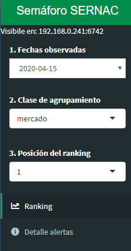
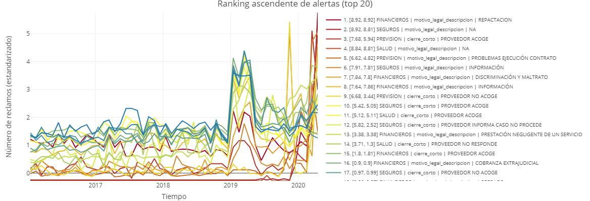
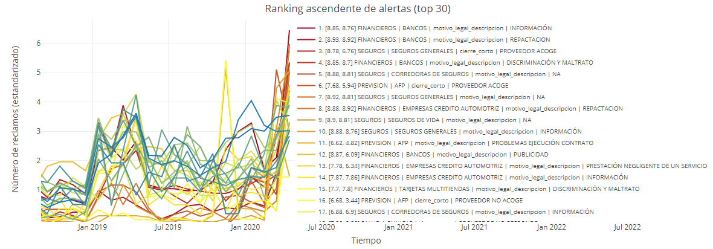
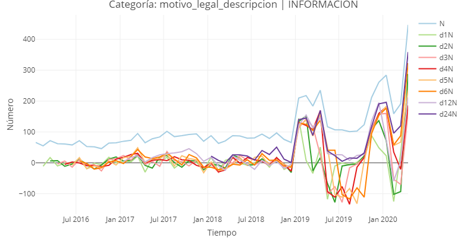
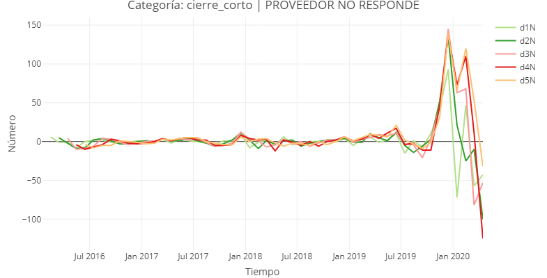

# Interpretación {#capitulo-interpretacion}

Una vez que se han definido las características y el tipo de ranking que se calcula (ver \@ref(seccion-ranking)), se puede invocar un visor dinámico que permite explorar los resultados obtenidos. Esta herramienta es sólo para visualizar y no permite ningún tipo de manipulación o exportación de la información (para exportar los datos, ver la sección \@ref(seccion-exportar)).

Antes de invocar el visor, es necesario cerciorarse de que se cuenta con las librerías `shiny` [@R-shiny], `shinydashboard` [@R-shinydashboard], `plotly` [@R-plotly] y `DT` [@R-DT]. Luego, se puede correr el siguiente código para desplegar el visor interactivo:

```{r, eval=FALSE}
outt <- extraer_series(outt)
outt <- reportar(outt)

shinyPlot(outt)
```

A continuación se presenta una descripción de las funcionalidades del visor y de como es posible extraer la información generada por la librería.


## Visor de resultados {#visor-graficos}

El visor despliega una ventana independiente, que puede ser accedida también desde un navegador web (esta última opción es más recomendable). En este se puede ver un panel lateral con opciones y una ventana principal con los diferentes gráficos de resultados.

En el panel lateral izquierdo, se observan tres listas desplegables (ver figura \@ref(fig:shiny-panel-lateral)):

1. Fechas observadas: indica la fecha agrupada del periodo de reclamos a observar (para más detalles ver sección \@ref(seccion-ranking)).
1. Clase de agrupamiento: qué *Clase* se observa (ver sección \@ref(seccion-agrupacion) para más detalles).
1. Posición del ranking: la posición del ranking específica que se desea visualizar (válido sólo para \@ref(seccion-plotly-detalle)).

```{r shiny-panel-lateral, echo=FALSE, fig.align='center', out.width = '25%', fig.cap="Ejemplo del panel izquierdo del visor. La fecha seleccionada engloba al mes de Abril del 2020, para la *Clase* mercado, en la primera posición (en la parte superior, se muestra la dirección IP interna para acceder desde un navegador web)."}

```

Una descripción más acabada de lo que se puede encontrar en cada pestaña, se puede apreciar en los siguientes apartados.


### Pestaña ranking {#seccion-plotly-ranking}

En un primer cuadro (superior), se encuentra un buscador de ruts, que es de utilidad cuando el agrupamiento seleccionado corresponde a un proveedor, o algún nivel mayor de detalle, dado que el agrupamiento se hace considerando el RUT del proveedor y no su nombre de fantasía (demasiado variable y extenso).

En los siguientes dos paneles (rojo y azul), se muestran todas las alertas ascendentes y descendentes (figura \@ref(fig:shiny-ranking-ascendente)). En ambos, se observa el número de reclamos en el tiempo para las primeras $n$ observaciones (siendo $n$ el número máximo de observaciones ranqueadas que se muestran, como se muestra en la sección \@ref(seccion-ranking). Debido a las probables diferencias en magnitudes y para facilitar la visualización, se utilizan los valores estandarizados (\@ref(estandarizacion)).

Los gráficos son interactivos y dinámicos; se puede acercar/alejar, mover/cambiar los ejes, exportar como imagen, cambiar la forma en que se despliega la ventana informativa al pasar por un nodo y seleccionar uno/todos los registros haciendo doble clic sobre la leyenda.

```{r shiny-ranking-ascendente, echo=FALSE, fig.align='center', out.width = '100%', fig.cap="Ejemplo del panel central superior del visor. La fecha seleccionada engloba al mes de Abril del 2020, para la *Clase* mercado."}

```

La configuración de la leyenda varía dependiendo de la *Clase* seleccionada. La figura \@ref(fig:shiny-ranking-ascendente) corresponde al mes de Abril del 2020, para la *Clase* mercado. En este caso, cada línea es una posición del ranking y para este ejemplo, se utilizó el ranking por número (sección \@ref(ranking-por-numero)). Cada etiqueta está constituida por:

1. El número de la posición
1. El puntaje obtenido ([interno, externo]), cuantificado como la suma de los percentiles de las métricas ascedentes (o descedentes, según corresponda). Independiente del tipo de ranking, este puntaje se despliega siempre para facilitar la interpretación, diferenciado según el puntaje interno y externo externo. Para más detalles ver la sección \@ref(ranking-por-puntaje).
1. Una combinación de la *Clase* y la *Categoría* correspondiente a la posición del ranking (mayores detalles en la sección \@ref(seccion-agrupacion)).

A modo de ejemplo, en la figura \@ref(fig:shiny-ranking-ascendente) si se mira la primera posición, se observa que el mercado financiero ocupa la primera posición, para el motivo legal repactación. A pesar de que el ranking está ordenado por número, se muestra que tiene un puntaje $8.92$ tanto internamente (con respecto al histórico del mercado), como externamente (con respecto a todos los motivos legales por repactación).

Si ahora se mira la figura \@ref(fig:shiny-ranking-ascendente-industria), el ranking ha visto modificado. El único parámetro que se modificó, es que ahora la *Clase* es industria (el resto permanece igual). En el primer lugar, también se observa el mercado financiero, pero ahora se agregó la industria (Bancos), para el motivo legal de información, con un puntaje $8.85$ y $8.76$ (interna y externamente). Esto quiere decir, que dentro del mercado financiero, la industria que aparece en primer lugar es la banca (tiene un alza en el número de reclamos importante, para el periodo observado). Si se mira el tercer lugar, se ve que corresponde al mercado de seguros, industria de seguros generales para el tipo de cierre en que el proveedor acoge la solicitud (para seguros generales, hubo un alza en el número de reclamos en que el proveedor aceptó la solicitud).

```{r shiny-ranking-ascendente-industria, echo=FALSE, fig.align='center', out.width = '100%', fig.cap="Ejemplo del panel central superior del visor. La fecha seleccionada engloba al mes de Abril del 2020, para la *Clase* industria."}

```

La opción *Posición del ranking* no tienen ningún efecto en esta pestaña, ya que se visualizan todos los puestos.


### Pestaña detalle alertas {#seccion-plotly-detalle}

Similar a la pestaña [Ranking](#seccion-plotly-ranking), pero ahora cada gráfico es específico para la ubicación seleccionada en posición del ranking. La ventana superior, en vez de contener el buscador de ruts, contiene un detalle de lo que está seleccionado en la alerta ascendente y descendente. Primero indica el puntaje de la observación (indpendiente del tipo de ranking) y luego muestra las *Clases* que corresponden.

Luego siguen dos cajas con gráficos, el de la izquierda (azul) hace referencia a las alertas descendentes y el de la derecha (rojo), a las alertas ascedentes. El título de uno indica la *Categoría* atípica encontrada, para la posición del ranking declarada. En ambos gráficos, cada línea representa la métrica que sobrepasó los límites establecidos y que fue considerada como atípica, para dicha observación.

En la figura \@ref(fig:shiny-detalle-ascendente-industria) se puede ver un ejemplo donde figura el gráfico de métricas para la alerta ascendente en la primera posición, para el mercado financiera y la industria de la banca (mismo ejemplo de la sección anterior). El título del gráfico indica que la alerta se produjo en la *Categoría* motivo legal de descripción. Se puede apreciar que las métricas que marcan que esta observación es atípica, son el número de reclamos en Abril del 2020 y la diferencia en el número de reclamos a 1, 2, 3, 4, 5, 6, 12 y 24 meses.

```{r shiny-detalle-ascendente-industria, echo=FALSE, fig.align='center', out.width = '100%', fig.cap="Ejemplo del panel central derecho del visor, para la pestaña de Detalles. La fecha seleccionada engloba al mes de Abril del 2020, para la *Clase* industria."}

```

Para el mismo caso, pero para la alerta descendente (\@ref(fig:shiny-detalle-descendente-industria)), se puede ver que la *Categoría* que resalta en el primer lugar (título del gráfico) es el tipo de cierre en que el proveedor no responde. La anomalía se presenta en el número de reclamos con respecto a 1, 2, 3, 4 y 5 meses.

```{r shiny-detalle-descendente-industria, echo=FALSE, fig.align='center', out.width = '100%', fig.cap="Ejemplo del panel central izquierdo del visor, para la pestaña de Detalles. La fecha seleccionada engloba al mes de Abril del 2020, para la *Clase* industria."}

```

Al final aparece un resumen con la composición de las *Clases* y *Categoría*. También aparece el buscador de RUTs, para facilitar el reconocimiento de los proveedores (en el caso de que figure alguno).

## Exportar información {#seccion-exportar}

Si se desea exportar tablas con los resultados, se puede hacer con:
  
```{r eval=FALSE}
exportar(outt, que=c('ranking'), verbose=T)
```

El comando anterior exportará archivos de texto en formato csv en inglés, cuyas columnas están separadas por coma (`,`) y el marcador decimal en números está definido por un punto (`.`). Si desea exportarlas en un formato en "español" (o cualquier otro) se puede especificar el separador de columnas y de decimales, con la siguiente instrucción:
  
```{r eval=FALSE}
exportar(outt, que=c('ranking'), verbose=T, sep=";", dec=",")
```

Dependiendo de la configuración del computador (normalmente el idioma), el archivo podrá ser abierto directamente en Excel sin mayores modificaciones (si la configuración/idioma del computador está en inglés y se abre un archivo exportado en formato inglés, abrirá sin problemas y lo mismo para el caso en español). El programa escribirá un total de 8 archivos, a los cuales atepondrá la fecha y hora (en formato YYYY-mm-dd_HHMMSS) para evitar sobreescribir resultados anteriores.

Algunas columnas que tienen en común todos estos archivos:

1. `clase`: la *Clase* (sección \@ref(seccion-agrupacion)) a la que pertenece el registro.
1. `up` o `reclamo_ascendente`: indica si es una alerta ascendente (`TRUE`) o descendente (`TRUE`).
1. `posicion`: la posición del ranking (número entero del 1 a `topn`).
1. `t`: el tiempo observado.

Se exportarán los siguientes archivos (usando como ejemplo la fecha del 2020-07-17 a las 16:28:34:

1. `2020-07-17_162834_top_ranking_formato_ancho.csv`: cada registro es una posición del ranking. `N_registros` con tiene el número de observaciones en el momento `t` y `metrics` indica las métricas que hicieron saltar la alerta.
1. `2020-07-17_162834_top_ranking_formato_ancho_industria.csv`: cada registro es una posición del ranking. Similar al archivo anterior, pero está seleccionado sólo lo que es industria. Contiene mayor información sobre los parámetros para cálcular el ranking, así como el valor del percentil de cada métrica que fue clasificada como atípica.
1. `2020-07-17_162834_top_ranking_formato_ancho_mercado.csv`: cada registro es una posición del ranking. Similar al archivo anterior, pero separado por industria y mercado.
1. `2020-07-17_162834_top_ranking_formato_ancho_producto.csv`: cada registro es una posición del ranking. Similar al archivo anterior, pero separado por industria, mercado y proveedor.
1. `2020-07-17_162834_top_ranking_formato_ancho_proveedor.csv`: cada registro es una posición del ranking. Similar al archivo anterior, pero separado por industria, mercado, proveedor y producto.
1. `2020-07-17_162834_top_ranking_formato_largo.csv`: cada registro no es necesariamente una posición del ranking. Contiene la misma información que `top_ranking_formato_ancho.csv`, en formato largo en vez de ancho.
1. `2020-07-17_162834_top_ranking_reclamos_caso_numero.csv`: cada registro es un reclamo. Estructura similar a `top_ranking_formato_ancho.csv`, pero cada observación pertenece a un cliente, y en vez de indicar las métricas que son atípicas, incluye la descripción del reclamo y el número de caso. Este formato es particularmente útil para SERNAC, ya que muestra todos los reclamos que constituyen una alerta. Es importante destacar, que sólo se exportan los reclamos dese la *Clase* que contenga el rut del proveedor, caso contrario, se terminaría obteniendo la casi totalidad de la base de datos.
1. `2020-07-17_162834_top_ranking_serie_formato_largo.csv`: cada registro es una fecha agrupada. Contiene la información suficiente para hacer gráficos de las series temporales de aquellas agrupaciones que tenían un número de reclamos atípicos en el tiempo observado.

